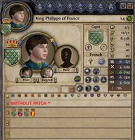
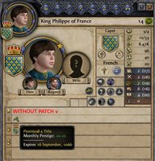
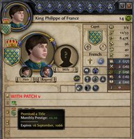

# Proper 4K UI Project - CleanSlate Patch

A compatibility patch for the Proper 4K UI Project + CleanSlate stack. Bundles assets from [Proper 4K UI Project](https://steamcommunity.com/sharedfiles/filedetails/?id=3054987840) by [LuvianQ](https://steamcommunity.com/id/luvian03) — please go rate and favorite the original mod.

<p align="center">
  <a href="docs/traits-without-patch.jpg"></a>
  <a href="docs/traits-with-patch.jpg"></a>
</p>
<p align="center">
  <a href="docs/modifiers-without-patch.jpg"></a>
  <a href="docs/modifiers-with-patch.jpg"></a>
</p>

## What it does

Aligns Proper 4K UI Project's assets with CleanSlate's changes.

### Trait icons

CleanSlate renames vanilla trait IDs (e.g. `fair` → `attractive`, `robust` → `brawny`), with new icon filenames to match. Proper 4K UI Project ships upscaled icons at the *vanilla* names, so under a CleanSlate + Proper 4K UI Project stack, the renamed traits fall back to CleanSlate's standard resolution icons. This patch bundles Proper 4K UI Project's icons under the CleanSlate names.

Covers all 29 renamed trait icons.

### Modifier icons

CleanSlate rearranges the vanilla `modifier_icons.dds` sprite strip so its icons come in good/bad pairs, changing which frame each `icon = N` value references. Proper 4K UI Project ships an upscaled strip in the original vanilla ordering, so under a CleanSlate + Proper 4K UI Project stack, CleanSlate's icon assignments render the wrong icons (e.g. `promised_a_title` shows a Military-looking icon instead of a Prestige crown). This patch bundles Proper 4K UI Project's icons in CleanSlate's frame ordering.

Covers all 134 frames in the modifier icon strip.

## Requirements

- **CleanSlate** — [GitHub](https://github.com/ck2plus/CleanSlate) or [Steam Workshop](https://steamcommunity.com/workshop/filedetails/?id=2674688018)
- **Proper 4K UI Project** — [Steam Workshop](https://steamcommunity.com/sharedfiles/filedetails/?id=3054987840)

## Installation

**Steam Workshop:** [subscribe](https://steamcommunity.com/sharedfiles/filedetails/?id=3758963186).

**Manual install:** drop `Proper4KUICleanSlatePatch/` and `Proper4KUICleanSlatePatch.mod` into:

```
Documents/Paradox Interactive/Crusader Kings II/mod/
```

…then enable **Proper4KUI - CleanSlate Patch** in the launcher.

## Compatibility

Proper 4K UI Project - CleanSlate Patch should work alongside any mods that are compatible with the CleanSlate + Proper 4K UI Project stack.

### CK2+ (CK2Plus)

Install alongside the [CK2Plus - Proper 4K UI Compatibility Submod](https://steamcommunity.com/sharedfiles/filedetails/?id=3054054196). That submod handles CK2Plus's game-content compatibility with Proper 4K UI Project. This patch handles the icon rendering issues CK2Plus inherits from the CleanSlate + Proper 4K UI Project stack.

## Community

- **[Steam Workshop Discussions](https://steamcommunity.com/workshop/filedetails/discussions/3758963186)** — Workshop discussion tab.
- **[Paradox Forums thread](https://forum.paradoxplaza.com/forum/threads/mod-proper-4k-ui-project-cleanslate-patch.1933296/)** — announcement thread.
- **[GitHub Issues](https://github.com/imposterzed/CK2Proper4KUICleanSlatePatch/issues/new/choose)** — structured template for bug reports.
- **[GitHub Discussions](https://github.com/imposterzed/CK2Proper4KUICleanSlatePatch/discussions)** — general questions and discussion.

## Credit & License

Upscaled icons belong to [LuvianQ](https://steamcommunity.com/id/luvian03) and the [Proper 4K UI Project](https://steamcommunity.com/sharedfiles/filedetails/?id=3054987840). Patch © 2026 imposterzed — MIT, see [LICENSE](LICENSE).
